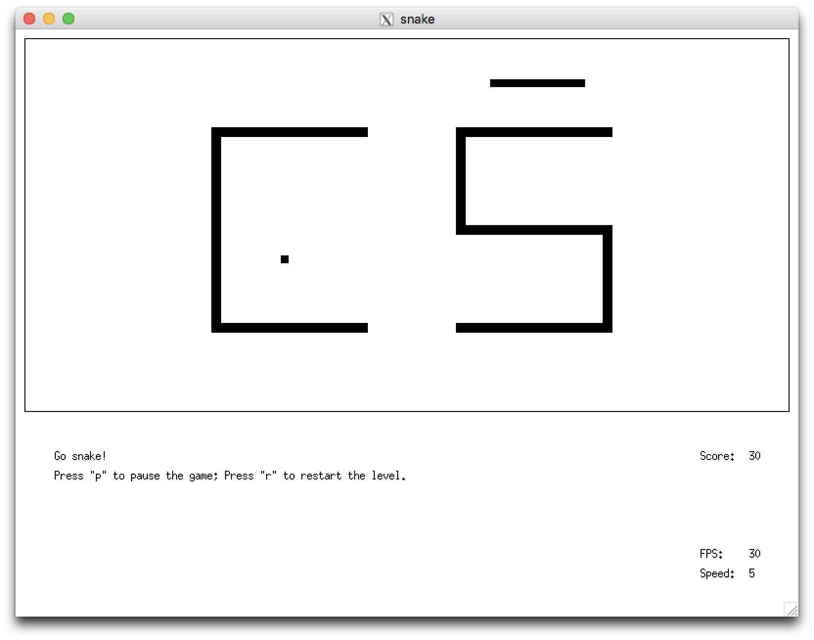

# Snake



## Game Description

### basic rules

- The game screen displays a snake (chain of blocks) always in motion and a fruit (block) at a fixed point on the screen.
- The direction of the snake can be controlled in that it can switch its direction by either turning left or right at a time.
- The objective of the snake is to eat the target fruit, which makes it grow in length. Each growth gives 10 points in the score. There is always only one fruit on the screen.
- As the snake eats the fruit, it disappears, and another one appears at a random location.
- The snake can die by eating itself (when it collides with itself) or by hitting obstacles.

### enhancements - creative level design

- The snake can wrap around to another side of borders.
- There are obstacles in the shape of "CS".

## Development Environment

- The game is written in standard `C++14`, which is specified in the `Makefile`.

## Design

### arguments
- The program either takes no arguments or takes two arguments, as described by the assignment.

### controls
- The game starts from a splash screen. Press any key to start the game.
- "WASD" to control snake's moving direction (no arrow keys).
- "q" to quit the game.
- "r" to restart the game.
- "P" to pause the game.

### game board
- The playable region is indicated by a rectangle shape. Snake, fruit, obstacles are inside it, other information is outside.
- Everything inside the gameboard is "snap to grid", think that there is an invisible grid, the snake follows the grid, as well as fruits and obstacles.
- The "grid" is `10x10`, however, objects might not has exact width of a grid. For example, the snake has width 8 so that it is easier to see the shape of the snake when snake turns closely (instead of a chunk of blocks).

### the snake

movement:
- The snake moves 1 pixel at a time, however, it only turns along the grid.
- The speed of the snake is controlled by adding the following line at the end of `move()` method.

```
usleep(1000000/speed);
```

growth:
- The snake grows 3 blocks when eating a fruit. This is implemented to make the growth more obvious.

wrap: [enhancement]
- The snake can wrap around to another side of borders.

### the fruit

regeneration:
- Each regeneration produces a random coordinates `(x, y)`.
- If the generated coordinates are on the snake, the fruit keeps regenerating until it doesn't.
- If the generated coordinates are on the obstacles, the fruit keeps regenerating until it doesn't.

### other information

constants:
- The FPS is always displayed at the bottom right of the screen.
- The snake speed is always displayed at the bottom right of the screen.

variables:
- The score is increased by 10 every time the snake eats a fruit / grows, displayed bottom right of the game board (outside).
- The status line 1 shows the current status of the snake, displayed bottom left of the game board (outside).
    - "Go snake!": you're playing normally.
    - "Game Paused": the game is paused, everything freezes.
    - "GAME OVER": your snake is dead, everything freezes, you cannot continue the game.
- The status line 2 shows more information related to the controls, displayed below status line 1.